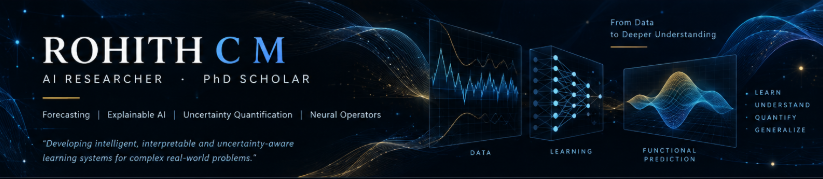

  

 

### AI Researcher · PhD Scholar

**Forecasting · Explainable AI · Uncertainty Quantification · Neural Operators**

---

## About Me

I am an AI researcher and PhD scholar interested in developing **intelligent, interpretable, and uncertainty-aware learning systems** for complex real-world problems.

My research explores advanced machine learning frameworks, with a particular interest in moving **beyond conventional neural-network architectures toward Neural Operators and operator learning**.

---

## Research Interests

<table>
<tr>
<td width="50%" valign="top">

### Forecasting & Time-Series Intelligence

Advanced learning frameworks for complex temporal dynamics and predictive modeling.

</td>
<td width="50%" valign="top">

### Explainable AI (XAI)

Developing interpretable models and understanding the factors behind AI predictions.

</td>
</tr>

<tr>
<td width="50%" valign="top">

### Uncertainty Quantification (UQ)

Characterizing predictive uncertainty to support more reliable AI systems.

</td>
<td width="50%" valign="top">

### Uncertainty-Aware Learning

Integrating uncertainty directly into learning and prediction frameworks.

</td>
</tr>

<tr>
<td width="50%" valign="top">

### Neural Operators

Exploring operator-learning approaches for learning mappings between function spaces.

</td>
<td width="50%" valign="top">

### Scientific Machine Learning

Combining data-driven learning with mathematical structure and dynamical systems.

</td>
</tr>
</table>

---

## Research Perspective

> I am interested in developing AI systems that go beyond predictive accuracy by incorporating **interpretability, uncertainty, and structural learning**. My current research explores the transition from conventional neural-network approaches toward **Neural Operators and operator learning**, with an emphasis on expressive, data-efficient, and uncertainty-aware models.

---

## Featured Research

<table>
<tr>
<td width="33%" valign="top">

### 🔎 ScholarSar

AI-powered literature discovery and screening platform.

**Python · Streamlit · Research Tool**

<a href="https://github.com/CMRohith/ScholarSar">View Repository →</a>

</td>

<td width="33%" valign="top">

### 📈 HODMD_STLF

Research framework for advanced time-series forecasting using HODMD and learning-based approaches.

**Python · Time Series · Forecasting**

<a href="https://github.com/CMRohith/HODMD_STLF">View Repository →</a>

</td>

<td width="33%" valign="top">

### 🧩 Causality

Research implementations and experiments in causal machine learning.

**Python · Causal AI · Machine Learning**

<a href="https://github.com/sivachandrakb/Causality">View Repository →</a>

</td>
</tr>
</table>

---

## Technical Stack

<table>
<tr>
<td valign="top" width="25%">

**Languages**

</td>

<td valign="top" width="30%">

**Machine Learning**

</td>

<td valign="top" width="25%">

**Tools**

</td>

<td valign="top" width="20%">

**Research**

`XAI` · `UQ` · `Neural Operators` · `Forecasting`

</td>
</tr>
</table>

---

## Connect With Me

**Research collaborations · technical discussions · academic opportunities**

 

&nbsp;

&nbsp;

&nbsp;

---

### From data to meaningful insights.

*Building intelligent, interpretable and uncertainty-aware learning systems.*

